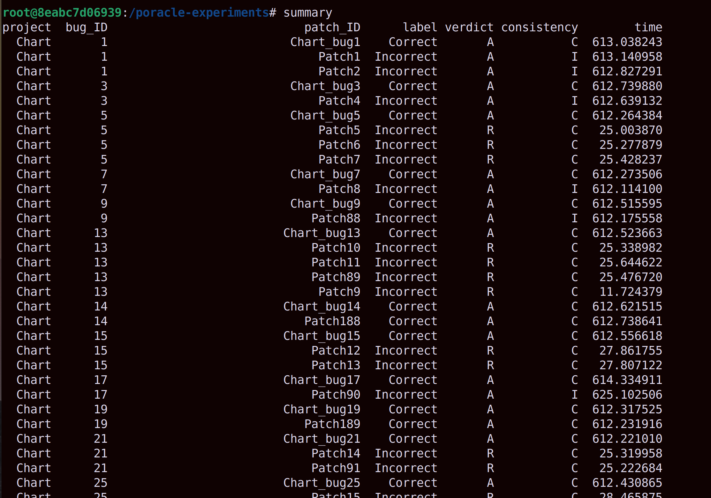

## What this repository is about ##

In our paper titled **Poracle: Testing Patches Under Preservation Conditions To Combat the Overfitting Problem of Program Repair**, we propose a new patch validation approach. Our approach involves (1) generalizing an existing failing test to add a preservation condition (the condition under which program behavior should be preserved between a buggy version and its patched version) and (2) performing differential fuzzing whose goal is to find out witness input for which a buggy version and its patched version produce different output despite the fact that the provided preservation condition is satisfied.

In this repository, we share the artifacts we used in our study. Our artifacts consist of

- [What this repository is about](#what-this-repository-is-about)
- [Downloading and accessing the container](#downloading-and-accessing-the-container)
- [Basic usage](#basic-usage)
- [How to reproduce the experimental results](#how-to-reproduce-the-experimental-results)
- [How to reproduce the JAID experiment results](#how-to-reproduce-the-jaid-experiment-results)
- [How to obtain the latest experimental results](#how-to-obtain-the-latest-experimental-results)
- [Evidence for mislabeled patches](#evidence-for-mislabeled-patches)
- [Generalized tests](#generalized-tests)
    - [Table of generalized tests](#table-of-generalized-tests)
- [User Study](#user-study)

## Downloading and accessing the container

Our Docker container image can be downloaded as follows:

```bash
$ docker pull poracle100/poracle-reproduce:latest
```

Once the image is downloaded, a container can be started as follows.

```bash
$ docker run -p 1000:22 --name poracle-reproduce --rm -d poracle100/poracle-reproduce:latest
```

Note that our container runs sshd, and it can be accessed through port 1000 as follows (you can replace port number 1000 with another port you want).

```bash
$ ssh root@localhost -p 1000
```

The password of the container is "poracle".

## Basic usage

Our main script (i.e., `poracle`) is available in the `/poracle-experiments` directory.

```bash
cd /poracle-experiments/
```

The following shows an example usage of `poracle`.

```bash
$ poracle configs/Patch7.json --duration 10m
```

where time limit for fuzzing is set to 10 minutes, and the information about the target patch is given through `configs/Patch7.json` which contains the following:


```json
{"ID": "Patch7", "tool": "Nopol2015", "correctness": "Incorrect", "bug_id": "5", "project": "Chart",
  "target": ["org/jfree/data/xy/XYSeries.java:563"]}
```
- ID: patch ID
- tool: the tool that produced the patch
- correctness: the label of the patch (either Correct or Incorrect)
- bug_id: bug ID as defined in [Defects4J](https://github.com/rjust/defects4j)
- project: project as defined in [Defects4J](https://github.com/rjust/defects4j)
- target: patch line(s)

Once the `poracle` script terminates normally, the following line will be printed (we internally use a fuzzer and the result may be different occasionally):

```
INFO     poracle         Results: [(<Judge.REJECT: 1>, <Validate.MATCH: 0>)]
```

`Judge.REJECT` denotes that the patch is recommended to be rejected (please ignore number 1 which simply refers to the ID for `Judge.REJECT`). `Validate.MATCH` will be explained later. Note that we reject the patch when an output difference is observed between a given patched version and its original version, while the preservation condition holds. To see which input causes the output difference, type the following: (the `.poracle` directory is created when running the `poracle` script)

```
$ ls .poracle/fuzz-results/test1/1/diff_out/
```

When a patch is recommended to be rejected, the `diff_out` directory contains one input file. Let's say the `diff_out` directory contains `id_000000005`. The `id_000000005` file is written in the binary format, and its corresponding text-format file should be available in the following path (replace `id_000000005` with the actual ID that is obtained):

```
.poracle/log/test1/1/ORG/id_000000005/IN.log
```

At the time of writing this document, the following `IN.log` file was obtained (you may obtain different values due to the randomness of fuzzing).

```
-1;-2;1;0.8926526466663729;0.9953236612191507
```

The five values delimited by the semicolon represent the values of the five parameters of the following [test](deltas/Chart/Chart_bug5/tests/org/jfree/data/xy/junit/JQF_XYSeriesTests.java):

```Java
public void testBug1955483(@InRange(minInt=-4, maxInt=6) int i1,
                           @InRange(minInt=-4, maxInt=6) int i2,
                           @InRange(minInt=-4, maxInt=6) int i3,
                           @InRange(minDouble=0, maxDouble=1) double ch1,
                           @InRange(minDouble=0, maxDouble=1) double ch2) {
    ...
    series.addOrUpdate(i1, i2);
    ...
}
```

where the `@InRange` annotation is used to define the range of the five random variables. We assigned a range based on the original value of each random variable. For example, `i1` is used in `series.addOrUpdate(i1, i2)` which corresponds to `series.addOrUpdate(1.0, 1.0)` of the original test in Defects4J. Notice that we replace value 1.0 into range [-4, 6]. Note that the specified ranges of the parameters are only initial ones, and the actual ranges are adjusted during the fuzzing process, as described in the paper. 

When input `id_000000005` is used, a different output is produced between the original version and its patched version. To see the difference, do the following:

```
$ diff .poracle/log/test1/1/ORG/id_000000005/OUT.log .poracle/log/test1/1/PATCH/id_000000005/OUT.log
```

You may see a result similar to the following:

```
1c1
< -2.0;-1.0;-1.0;-2.0;1.0;-2.0
\ No newline at end of file
---
> -1.0;-2.0;-2.0;-1.0;1.0;-2.0
\ No newline at end of file
```


Our `poracle` script also validates its patch validation result by making use of a ground-truth correct version available through Defects4J. By running the correct version with the obtained difference-witnessing input (`id_000000005` in our running example), it can be checked whether a different output is also obtained between the original version and its correct version.

Recall that the `poracle` script produces the following result.

```
INFO     poracle         Results: [(<Judge.REJECT: 1>, <Validate.MATCH: 0>)]
```

`Validate.MATCH` in the output denotes the fact that output difference is indeed also observed between the original version and its (developer-provided) fixed version. In other words, our recommendation matches the ground-truth. The following table provides the description of 4 possible cases. Note that when no difference-witnessing input is found, `poracle` recommends ACCEPT and its validity is checked with the ground-truth label available in our benchmark.


| Judge         | Validate          | Description                             |
|---------------|-------------------|-----------------------------------------|
|Judge.REJECT   |Validate.MATCH     | A rejection recommendation is correct   |
|Judge.REJECT   |Validate.MISMATCH  | A rejection recommendation is incorrect |
|Judge.ACCEPT   |Validate.MATCH     | An acceptance recommendation is correct |
|Judge.ACCEPT   |Validate.MISMATCH  | A rejection recommendation is incorrect |


## How to reproduce the experimental results

Our experimental results can be reproduced by running the`runexp_all` script as follows:

```bash
$ cd /poracle-experiments/ && ./runexp_all reproduce 1
```

The`runexp_all` script enumerates over all patches in our benchmark, and stores generated files in the `poracle_results/reproduce/1` directory (The `1` refers to the experiment ID).

The obtained experimental results can be printed out by running the `summary` script.

```bash
$ cd /poracle-experiments
$ summary poracle_results
```

The following shows a snippet of the output of `summary` (Table 3 of our paper is extracted from this output).



The "label" column shows the labels (either Correct or Incorrect) available in our benchmark extracted from the existing work. The description of the "verdict" and "consistency" columns follow the description of "Judge" and "Validate" provided earlier. "A" and "R" represent "Judge.ACCEPT" and "Judge.REJECT", respectively, and "C" and "I" represent "Validate.MATCH" and "Validate.MISMATCH", respectively.

## How to reproduce the JAID experiment results

We used [JAID tool](https://bitbucket.org/maxpei/jaid/wiki/Home) to generate patches for all the bugs we have. We have used "Autofix" option of JAID. We stored all the JAID patches into the `patches` directory. Then we ran Poracle with the Jaid patches to see if we can reject many incorrect patches while keeping correct patches. Our JAID experiment result can be reproduced by running the`runexp_all_jaid` script as follows:

```bash
$ cd /poracle-experiments/ && ./runexp_all_jaid math105 1 --rank 265 --bug-version math_105
```
Here, `--rank 265` means the original rank of the correct patch. We used this option to let the script know the rank of the correct patch, so that it will run all the patches before this number. Note that we also checked whether the correct patch is rejected or not. `--bug-version math_105` means, it is running the patches for Math105 bug. 
The `runexp_all_jaid` script enumerates over all Jaid patches for Math105 (the subject buggy version), and stores generated results in the `poracle_results/1` directory (The `1` refers to the experiment ID).

The obtained experimental results can be printed out on the screen by running the `summary` script.

```bash
$ cd /poracle-experiments
$ summary poracle_results
```

## How to obtain the latest experimental results

Our latest experimental results are available in the `/poracle-experiments/latest_results' directory. Running the `summary` script will show the results on the screen.

```bash
$ cd /poracle-experiments
$ summary latest_results
```

## Evidence for mislabeled patches

As a byproduct of our approach, we found that 4 patches in our dataset obtained from the existing study are mislabeled. While these patches are labeled correct in the original dataset, Poracle found an input that causes output difference between the buggy version and its patched version. We validate these results with the ground-truth correct versions available in Defects4J benchmark, and indeed correct and patched versions produce different results when the same inputs found by Poracle are used. In this repository, we provide concrete evidence for those mislabeled patches --- i.e., witness tests whose executions result in different behavior between patches versions and their ground-truth correct versions. By using these witness tests, behavioral discrepancy can be easily observed, without having to install and run Poracle.

Recall that Poracle takes as input a parameterized test, as shown in the following.

```Java
public void testBug1955483(@InRange(minInt=-4, maxInt=6) int i1,
                           @InRange(minInt=-4, maxInt=6) int i2,
                           @InRange(minInt=-4, maxInt=6) int i3,
                           @InRange(minDouble=0, maxDouble=1) double ch1,
                           @InRange(minDouble=0, maxDouble=1) double ch2) {
    ...
    series.addOrUpdate(i1, i2);
    ...
}
```

We earlier showed that Poracle generated the following input:

```
-1;-2;1;0.8926526466663729;0.9953236612191507
```

Based on this input, we prepared the following JUnit test:

```Java
public void testBug1955483() {
    ...
    series.addOrUpdate(-1, -2);
    ...
}
```

Notice that we replace `i1` and `i2` with their corresponding difference-witnessing input values `-1` and `-2`. The obtained witness test is available [here](mislabeled_patches/Patch7/tests/org/jfree/data/xy/junit/JQF_XYSeriesTests.java).

We now describe how to reproduce behavioral discrepancy between an Patch7 (an incorrect patch that is labeled correct) and its ground-truth correct version. The following commands checkout Chart 5b (a buggy version), overwrite JQF_XYSeries.java with its patched version, and build the project.

```bash
$ bash -c "cd /tmp && \
  defects4j checkout -p Chart -v 5b -w Chart5p && \
  cp /poracle-experiments/mislabeled_patches/Patch7/source/org/jfree/data/xy/XYSeries.java Chart5p/source/org/jfree/data/xy/ && \
  cp /poracle-experiments/mislabeled_patches/Patch7/tests/org/jfree/data/xy/junit/JQF_XYSeriesTests.java Chart5p/tests/org/jfree/data/xy/junit/ && \
  defects4j compile -w Chart5p"
```

Similarly, the following commands build Chart 5f (a ground-truth correct version).

```bash
$ bash -c "cd /tmp && \
  defects4j checkout -p Chart -v 5f -w Chart5f && \
  cp /poracle-experiments/mislabeled_patches/Patch7/tests/org/jfree/data/xy/junit/JQF_XYSeriesTests.java Chart5f/tests/org/jfree/data/xy/junit/ && \
  defects4j compile -w Chart5f"
```

The output of `testBug1955483` for the patched version can be obtained using the following commands.

```bash
$ bash -c "cd /tmp/Chart5p && \
  ant -f /poracle-experiments/benchmark/defects4j/framework/projects/defects4j.build.xml \
      -Dd4j.home=/poracle-experiments/benchmark/defects4j \
      -Dbasedir=/tmp/Chart5p \
      -DOUTFILE=/tmp/Chart5p/failing_tests -Dtest.entry.class=org.jfree.data.xy.junit.JQF_XYSeriesTests \
      -Dtest.entry.method=testBug1955483 run.dev.tests && \
  cd -"
```

The output will include the following line:

```
[junit] [-1.0, -2.0, -2.0, -1.0, 1.0, -2.0]
```

Meanwhile, the result of the same test can be obtained from the ground-truth correct version using the following command.

```bash
$ bash -c "cd /tmp/Chart5f && \\
  ant -f /poracle-experiments/benchmark/defects4j/framework/projects/defects4j.build.xml \
      -Dd4j.home=/poracle-experiments/benchmark/defects4j \
      -Dbasedir=/tmp/Chart5f -DOUTFILE=/tmp/Chart5f/failing_tests \
      -Dtest.entry.class=org.jfree.data.xy.junit.JQF_XYSeriesTests \
      -Dtest.entry.method=testBug1955483 run.dev.tests && \\
  cd -"
```

The output will include the following line:

```
[junit] [-2.0, -1.0, -1.0, -2.0, 1.0, -2.0]
```

Notice the difference between the two outputs.


The following table provides links to witness tests and patched files for all 4 mislabeled patches.


| Patch ID  | Project | Bug ID | Witness Test    | Patched file |
| ----------| -------| ------ | ----------------|--------------|
| Patch7    | Chart  |  5     |[JQF_XYSeriesTests.java](mislabeled_patches/Patch7/tests/org/jfree/data/xy/junit/JQF_XYSeriesTests.java) | [XYSeries.java](mislabeled_patches/Patch7/source/org/jfree/data/xy/XYSeries.java)|
| Patch26   | Lang   |  58    |[JQF_NumberUtilsTest.java](mislabeled_patches/Patch26/src/test/org/apache/commons/lang/math/JQF_NumberUtilsTest.java)|[NumberUtils.java](mislabeled_patches/Patch26/src/java/org/apache/commons/lang/math/NumberUtils.java) |
| Patch54   | Math   |  73    |[JQF_BrentSolverTest.java](mislabeled_patches/Patch54/src/test/java/org/apache/commons/math/analysis/solvers/JQF_BrentSolverTest.java) |[BrentSolver.java](mislabeled_patches/Patch54/src/main/java/org/apache/commons/math/analysis/solvers/BrentSolver.java) |
| Patch192  | Lang   |  35    |[JQF_ArrayUtilsAddTest.java](mislabeled_patches/Patch192/src/test/java/org/apache/commons/lang3/JQF_ArrayUtilsAddTest.java) |[ArrayUtils.java](mislabeled_patches/Patch192/src/main/java/org/apache/commons/lang3/ArrayUtils.java) |


## Generalized tests

The generalized tests we used in our experiments are available in the [deltas](deltas) directory. In each sub-directory, we use the following name convention ```[Project]_bug[bug_id]``` such as ```Math/Math_bug2```. We provide a table that contains links to the generalized tests, along with the following additional columns:

- The **#Patches** column shows the number of patches that can be validated with a given generalized test.
- The **Pattern** column shows a pattern we used to prepare a preservation condition. We use the following 4 patterns whose description is available in our paper (see Section 4.1).
  - UE (Unexpected Exception)
    -  We enclose the original test code inside a try-catch block to ignore abnormal termination of the buggy version.
  - CC (Complementary Cases)
    -  Behavioral preservation is enforced for the inputs complementary to the original test input.
  - EGA (Existing Assertion)
    - We use an existing assertion condition as a preservation condition.
  - RI (Reference Implementation)
    - We use a reference implementation that performs the same functionality in a preservation condition.
- The **Complexity** column shows the complexity of the preservation condition that is defined as the number of relation operators used (e.g., >, >=) and the number of Boolean connectives, && and ||. We do not count the negation operator (!). Note that "!(x > y)" can be expressed with "x <= y" without using !.

#### Table of generalized tests
| Project | ID | #Patches | Pattern | Complexity |
|:-----: | :--: | :--------: | :------ | :----------: |
|Math | [2](deltas/Math/Math_bug2/src/test/java/org/apache/commons/math3/distribution/JQF_HypergeometricDistributionTest.java) | 10 | CC | 1 |
|Math | [3](deltas/Math/Math_bug3/src/test/java/org/apache/commons/math3/util/JQF_MathArraysTest.java) | 4 | UE | 0 |
|Math | [4](deltas/Math/Math_bug4/src/test/java/org/apache/commons/math3/geometry/euclidean/threed/JQF_SubLineTest.java) | 14 | UE | 0 |
|Math | [5](deltas/Math/Math_bug5/src/test/java/org/apache/commons/math3/complex/JQF_ComplexTest.java) | 10 | CC | 1 |
|Math | [7](deltas/Math/Math_bug7/src/test/java/org/apache/commons/math3/ode/nonstiff/JQF_DormandPrince853IntegratorTest.java) | 3 | UE | 0 |
|Math | [8](deltas/Math/Math_bug8/src/test/java/org/apache/commons/math3/distribution/JQF_DiscreteRealDistributionTest.java) | 9 | UE | 0 |
|Math | [22](deltas/Math/Math_bug22/src/test/java/org/apache/commons/math3/distribution/JQF_FDistributionTest.java) | 5 | EGA | 2 |
|Math | [24](deltas/Math/Math_bug24/src/test/java/org/apache/commons/math3/optimization/univariate/JQF_BrentOptimizerTest.java) | 2 | EGA | 1 |
|Math | [25](deltas/Math/Math_bug25/src/test/java/org/apache/commons/math3/optimization/fitting/JQF_HarmonicFitterTest.java) | 3 | CC | 1 |
|Math | [28](deltas/Math/Math_bug28/src/test/java/org/apache/commons/math3/optimization/linear/JQF_SimplexSolverTest.java) | 15 | UE | 0 |
|Math | [32](deltas/Math/Math_bug32/src/test/java/org/apache/commons/math3/geometry/euclidean/threed/JQF_PolyhedronsSetTest.java) | 6 | UE | 0 |
|Math | [33](deltas/Math/Math_bug33/src/test/java/org/apache/commons/math3/optimization/linear/JQF_SimplexSolverTest.java) | 9 | RI | 5 |
|Math | [34](deltas/Math/Math_bug34/src/test/java/org/apache/commons/math3/genetics/JQF_ListPopulationTest.java) | 3 | CC | 2 |
|Math | [35](deltas/Math/Math_bug35/src/test/java/org/apache/commons/math3/genetics/JQF_ElitisticListPopulationTest.java) | 8 | CC | 3 |
|Math | [39](deltas/Math/Math_bug39/src/test/java/org/apache/commons/math/ode/nonstiff/JQF_DormandPrince853IntegratorTest.java) | 2 | UE | 0 |
|Math | [40](deltas/Math/Math_bug40/src/test/java/org/apache/commons/math/analysis/solvers/JQF_BracketingNthOrderBrentSolverTest.java) | 8 | UE | 0 |
|Math | [41](deltas/Math/Math_bug41/src/test/java/org/apache/commons/math/stat/descriptive/moment/JQF_VarianceTest.java) | 6 | EGA | 5 |
|Math | [42](deltas/Math/Math_bug42/src/test/java/org/apache/commons/math/optimization/linear/JQF_SimplexSolverTest.java) | 5 | EGA | 2 |
|Math | [44](deltas/Math/Math_bug44/src/test/java/org/apache/commons/math/ode/events/JQF_EventStateTest.java) | 2 | UE | 0 |
|Math | [49](deltas/Math/Math_bug49/src/test/java/org/apache/commons/math/linear/JQF_SparseRealVectorTest.java) | 7 | UE | 0 |
|Math | [50](deltas/Math/Math_bug50/src/test/java/org/apache/commons/math/analysis/solvers/JQF_RegulaFalsiSolverTest.java) | 23 | CC | 0 |
|Math | [53](deltas/Math/Math_bug53/src/test/java/org/apache/commons/math/complex/JQF_ComplexTest.java) | 7 | CC | 1 |
|Math | [57](deltas/Math/Math_bug57/src/test/java/org/apache/commons/math/stat/clustering/JQF_KMeansPlusPlusClustererTest.java) | 9 | CC | 1 |
|Math | [58](deltas/Math/Math_bug58/src/test/java/org/apache/commons/math/optimization/fitting/JQF_GaussianFitterTest.java) | 12 | UE | 0 |
|Math | [61](deltas/Math/Math_bug61/src/test/java/org/apache/commons/math/distribution/JQF_PoissonDistributionTest.java) | 3 | CC | 1 |
|Math | [69](deltas/Math/Math_bug69/src/test/java/org/apache/commons/math/stat/correlation/JQF_PearsonsCorrelationTest.java) | 4 | EGA | 1 |
|Math | [70](deltas/Math/Math_bug70/src/test/java/org/apache/commons/math/analysis/solvers/JQF_BisectionSolverTest.java) | 11 | UE | 0 |
|Math | [71](deltas/Math/Math_bug71/src/test/java/org/apache/commons/math/ode/nonstiff/JQF_ClassicalRungeKuttaIntegratorTest.java) | 5 | EGA | 3 |
|Math | [73](deltas/Math/Math_bug73/src/test/java/org/apache/commons/math/analysis/solvers/JQF_BrentSolverTest.java) | 10 | CC | 10 |
|Math | [78](deltas/Math/Math_bug78/src/test/java/org/apache/commons/math/ode/events/JQF_EventStateTest.java) | 5 | UE | 0 |
|Math | [80](deltas/Math/Math_bug80/src/test/java/org/apache/commons/math/linear/JQF_EigenDecompositionImplTest.java) | 19 | RI | 1 |
|Math | [81](deltas/Math/Math_bug81/src/test/java/org/apache/commons/math/linear/JQF_EigenDecompositionImplTest.java) | 28 | UE | 0 |
|Math | [82](deltas/Math/Math_bug82/src/test/java/org/apache/commons/math/optimization/linear/JQF_SimplexSolverTest.java) | 20 | RI | 7 |
|Math | [84](deltas/Math/Math_bug84/src/test/java/org/apache/commons/math/optimization/direct/JQF_MultiDirectionalTest.java) | 15 | RI | 1 |
|Math | [85](deltas/Math/Math_bug85/src/test/java/org/apache/commons/math/distribution/JQF_NormalDistributionTest.java) | 24 | UE | 0 |
|Math | [87](deltas/Math/Math_bug87/src/test/java/org/apache/commons/math/optimization/linear/JQF_SimplexSolverTest.java) | 4 | RI | 1 |
|Math | [88](deltas/Math/Math_bug88/src/test/java/org/apache/commons/math/optimization/linear/JQF_SimplexSolverTest.java) | 14 | RI | 5 |
|Math | [89](deltas/Math/Math_bug89/src/test/java/org/apache/commons/math/stat/JQF_FrequencyTest.java) | 7 | CC | 1 |
|Math | [90](deltas/Math/Math_bug90/src/test/java/org/apache/commons/math/stat/JQF_FrequencyTest.java) | 4 | CC | 1 |
|Math | [93](deltas/Math/Math_bug93/src/test/java/org/apache/commons/math/util/JQF_MathUtilsTest.java) | 4 | EGA | 5 |
|Math | [95](deltas/Math/Math_bug95/src/test/java/org/apache/commons/math/distribution/JQF_FDistributionTest.java) | 15 | UE | 0 |
|Math | [97](deltas/Math/Math_bug97/src/test/java/org/apache/commons/math/analysis/JQF_BrentSolverTest.java) | 7 | UE | 0 |
|Math | [99](deltas/Math/Math_bug99/src/test/org/apache/commons/math/util/JQF_MathUtilsTest.java) | 4 | CC | 7 |
|Math | [104](deltas/Math/Math_bug104/src/test/java/org/apache/commons/math/special/JQF_GammaTest.java) | 3 | CC | 1 |
|Math | [105](deltas/Math/Math_bug105/src/test/org/apache/commons/math/stat/regression/JQF_SimpleRegressionTest.java) | 5 | EGA | 1 |
|Chart | [1](deltas/Chart/Chart_bug1/tests/org/jfree/chart/renderer/category/junit/JQF_AbstractCategoryItemRendererTests.java) | 3 | EGA | 1 |
|Chart | [3](deltas/Chart/Chart_bug3/tests/org/jfree/data/time/junit/JQF_TimeSeriesTests.java) | 2 | CC | 5 |
|Chart | [5](deltas/Chart/Chart_bug5/tests/org/jfree/data/xy/junit/JQF_XYSeriesTests.java) | 4 | UE | 0 |
|Chart | [7](deltas/Chart/Chart_bug7/tests/org/jfree/data/time/junit/JQF_TimePeriodValuesTests.java) | 2 | CC | 1 |
|Chart | [9](deltas/Chart/Chart_bug9/tests/org/jfree/data/time/junit/JQF_TimeSeriesTests.java) | 2 | UE | 0 |
|Chart | [13](deltas/Chart/Chart_bug13/tests/org/jfree/chart/block/junit/JQF_BorderArrangementTests.java) | 5 | UE | 0 |
|Chart | [14](deltas/Chart/Chart_bug14/tests/org/jfree/chart/plot/junit/JQF_CategoryPlotTests.java) | 2 | UE | 0 |
|Chart | [15](deltas/Chart/Chart_bug15/tests/org/jfree/chart/plot/junit/JQF_PiePlot3DTests.java) | 3 | UE | 0 |
|Chart | [17](deltas/Chart/Chart_bug17/tests/org/jfree/data/time/junit/JQF_TimeSeriesTests.java) | 2 | UE | 0 |
|Chart | [19](deltas/Chart/Chart_bug19/tests/org/jfree/chart/plot/junit/JQF_CategoryPlotTests.java) | 2 | CC | 1 |
|Chart | [21](deltas/Chart/Chart_bug21/tests/org/jfree/data/statistics/junit/JQF_DefaultBoxAndWhiskerCategoryDatasetTests.java) | 3 | CC | 1 |
|Chart | [25](deltas/Chart/Chart_bug25/tests/org/jfree/chart/renderer/category/junit/JQF_StatisticalBarRendererTests.java) | 5 | UE | 0 |
|Chart | [26](deltas/Chart/Chart_bug26/tests/org/jfree/chart/renderer/category/junit/JQF_BoxAndWhiskerRendererTests.java) | 4 | UE | 0 |
|Time | [4](deltas/Time/Time_bug4/src/test/java/org/joda/time/JQF_TestPartial_Basics.java) | 6 | CC | 1 |
|Time | [7](deltas/Time/Time_bug7/src/test/java/org/joda/time/format/JQF_TestDateTimeFormatter.java) | 7 | UE | 0 |
|Time | [11](deltas/Time/Time_bug11/src/test/java/org/joda/time/tz/JQF_TestCompiler.java) | 7 | EGA | 1 |
|Time | [12](deltas/Time/Time_bug12/src/test/java/org/joda/time/JQF_TestLocalDate_Constructors.java) | 2 | EGA | 1 |
|Time | [14](deltas/Time/Time_bug14/src/test/java/org/joda/time/JQF_TestMonthDay_Basics.java) | 3 | UE | 0 |
|Time | [15](deltas/Time/Time_bug15/src/test/java/org/joda/time/field/JQF_TestFieldUtils.java) | 4 | CC | 15 |
|Time | [16](deltas/Time/Time_bug16/src/test/java/org/joda/time/format/JQF_TestDateTimeFormatter.java) | 2 | EGA | 2 |
|Time | [18](deltas/Time/Time_bug18/src/test/java/org/joda/time/chrono/JQF_TestGJChronology.java) | 3 | UE | 1 |
|Time | [19](deltas/Time/Time_bug19/src/test/java/org/joda/time/JQF_TestDateTimeZoneCutover.java) | 8 | EGA | 1 |
|Lang | [24](deltas/Lang/Lang_bug24/src/test/java/org/apache/commons/lang3/math/JQF_NumberUtilsTest.java) | 7 | RI | 1 |
|Lang | [35](deltas/Lang/Lang_bug35/src/test/java/org/apache/commons/lang3/JQF_ArrayUtilsAddTest.java) | 2 | EGA | 9 |
|Lang | [39](deltas/Lang/Lang_bug39/src/test/org/apache/commons/lang3/JQF_StringUtilsTest.java) | 9 | RI | 0 |
|Lang | [44](deltas/Lang/Lang_bug44/src/test/org/apache/commons/lang/JQF_NumberUtilsTest.java) | 6 | RI | 1 |
|Lang | [46](deltas/Lang/Lang_bug46/src/test/org/apache/commons/lang/JQF_StringEscapeUtilsTest.java) | 7 | EGA | 1 |
|Lang | [51](deltas/Lang/Lang_bug51/src/test/org/apache/commons/lang/JQF_BooleanUtilsTest.java) | 3 | RI | 1 |
|Lang | [53](deltas/Lang/Lang_bug53/src/test/org/apache/commons/lang/time/JQF_DateUtilsTest.java) | 5 | RI | 1 |
|Lang | [55](deltas/Lang/Lang_bug55/src/test/org/apache/commons/lang/time/JQF_StopWatchTest.java) | 5 | EGA | 1 |
|Lang | [57](deltas/Lang/Lang_bug57/src/test/org/apache/commons/lang/JQF_LocaleUtilsTest.java) | 2 | EGA | 1 |
|Lang | [58](deltas/Lang/Lang_bug58/src/test/org/apache/commons/lang/math/JQF_NumberUtilsTest.java) | 15 | RI | 1 |
|Average |  | 6.87 |  | 1.58 |


## User Study

The user study materials are available in this repository. Check out the [user-study](user-study) folder.